# Switch Tester

Raspberry Pi tool for testing the switch matrix on early Bally solid-state pinball machines. Connects directly to the playfield switch harness (bypassing the MPU) to test switches, diodes, and wiring continuity.

First supported game: Bally Mata Hari (1978), AS-2518-17 platform.

Future plans include supporting other platforms, such as the Bally 6803. Basically any platform that uses up to 16 pins for its switch matrix on a single connector. (could do more than that, but the wiring on the breakout board would get really messy)

## Hardware

A breakout board bridges the Raspberry Pi GPIO header to the game's J2 (playfield switches) and J3 (cabinet switches) Molex KK connectors. No ground connection to the game is needed.



GPIO pin assignments and connector positions are defined in `platforms/as-2518-17.json`.

## Prerequisite - setting up the Raspberry Pi

Currently this tool works on the interactively on the linux commandline. As such you need a pi with the following:

- Network connectivity (Wireless strongly recommended)
- A stable source of USB power appropriate to your Pi
- SSH configured
- SSH tested using your account and password (or other authentication method)
- the `uv` package manager installed (does NOT need to be root): 

```bash
curl -LsSf https://astral.sh/uv/install.sh | sh
```

- This repo downloaded / cloned and in a location that you can write to (your homedir is a great choice)

## Setup

Requires a Raspberry Pi running Linux. Uses `uv` for package management.

```bash
uv sync
```

`RPi.GPIO` is Linux/ARM only and will not install on other platforms. On a Pi 5, `lgpio` is used automatically instead.

## Connecting to the pinball machine

Unplug the J2 or J3 (depending on which switches you want to test) connector and plug them into the appropriate port on the breakout board. J2 has 15 pins (and in the diagram is closest to teh RPI) and J3 has 16 pins. 

THE PINBALL MACHINE DOES NOT NEED TO BE ON FOR THIS. IN FACT I RECOMMEND AGAINST IT.

Plug the RPI into the USB powersource, let it boot, then SSH into the system. From there, run the below and work through the options to test your switches and diodes.


## Usage

```bash
switch-tester games/mata_hari.json

# Or without installing the entry point
uv run -m switchtester.cli games/mata_hari.json
```


### Commands

| Key | Command |
|-----|---------|
| `m` | Monitor mode -- continuous scan, reports switch open/close events |
| `d` | Diode reverse bias test -- detects shorted diodes |
| `w` | Walk test -- guided switch-by-switch verification |
| `s` | Snapshot -- current matrix state as a table |
| `l` | List all switches with wire colours |
| `p` | Pin continuity -- connect a jumper to identify which two pins are shorted |
| `r` | Remap pins -- guided verification and correction of GPIO-to-connector wiring |
| `q` | Quit |

### Pin remapper

Its strongly recommended that you run through the pin remapper at least once to make sure that your particular breakout board is working as expected and that all the pins go to the right place.  

The `r` command walks through each strobe and return pin. Connect a jumper wire between the pin under test and any other GPIO pin, then press Enter. The Pi detects which BCM pair is shorted and confirms it matches the expected connector position. On a mismatch it offers to swap the pin assignments, then saves corrections back to the platform file.

## Adding a game

Create a JSON file in `games/` following the structure of `games/mata_hari.json`. Set `"platform"` to the name of a file in `platforms/`. `num_cols` and `num_rows` are inferred automatically from the switch list, so larger matrices work without code changes.

## Adding a platform

Create a JSON file in `platforms/` with the BCM pin assignments and connector labels for the new board:

```json
{
    "platform": "as-6803",
    "description": "Bally AS-6803 platform",
    "col_pins": [...],
    "row_pins": [...],
    "strobe_labels": [...],
    "return_labels": [...]
}
```

Then set `"platform": "as-6803"` in any game JSON that uses it.
